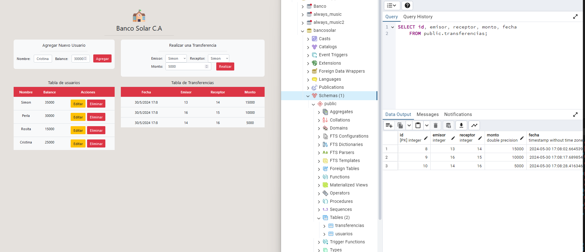

# Descargar

git clone https://github.com/siseveca79/BANCO-SOLAR

# Importar modules

npm install express cors pg body-parser express-validator

# Base de datos: 
CREATE DATABASE bancosolar;

CREATE TABLE usuarios (
id SERIAL PRIMARY KEY,
nombre VARCHAR(50),
balance FLOAT CHECK (balance >= 0)
);

CREATE TABLE transferencias (
id SERIAL PRIMARY KEY,
emisor INT,
receptor INT,
monto FLOAT,
fecha TIMESTAMP,
FOREIGN KEY (emisor) REFERENCES usuarios(id) ON DELETE CASCADE,
FOREIGN KEY (receptor) REFERENCES usuarios(id) ON DELETE CASCADE
);

# En CLI correr
node server.js

# Usar la app web

Servidor corriendo el http://localhost:3000/ 

# Resultados similares :

